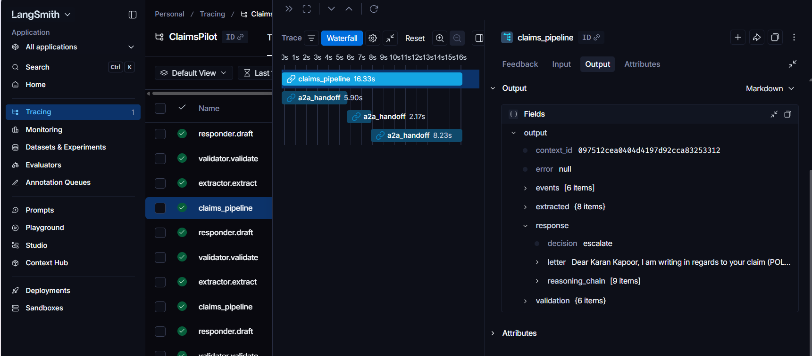
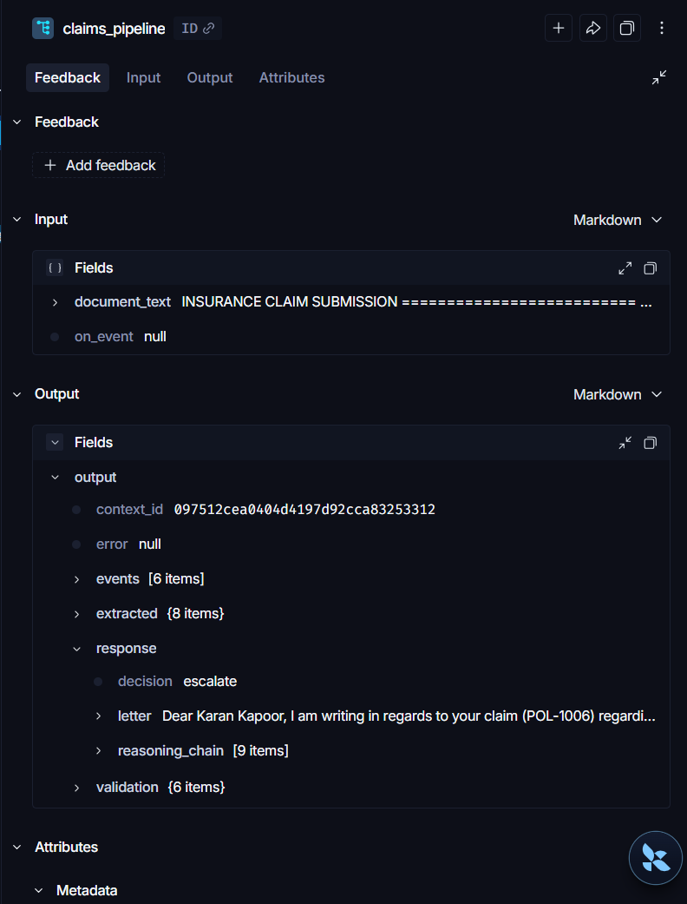
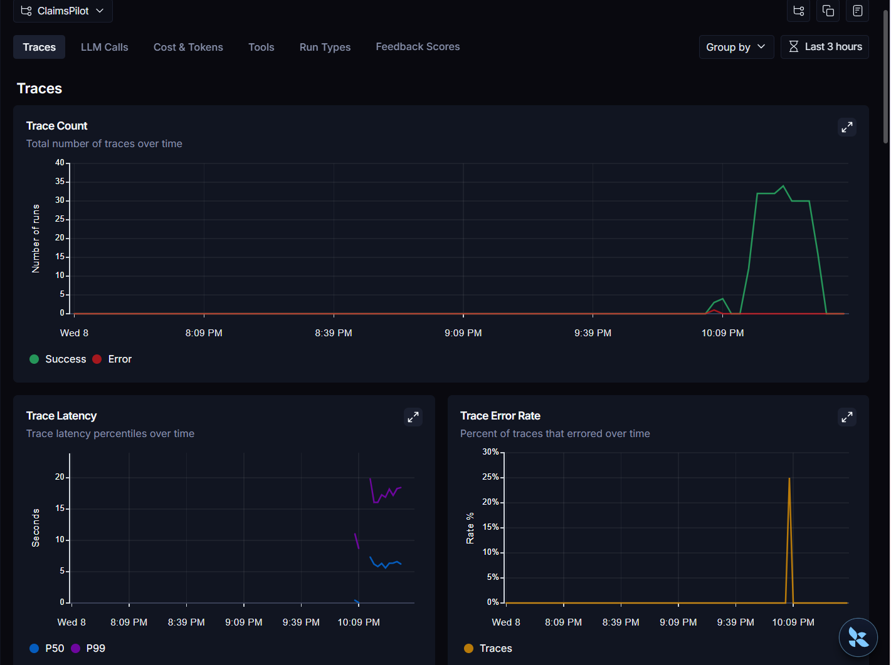
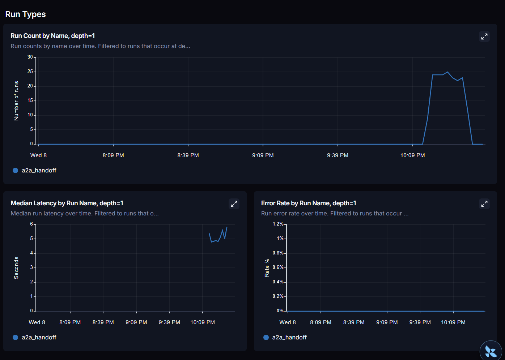
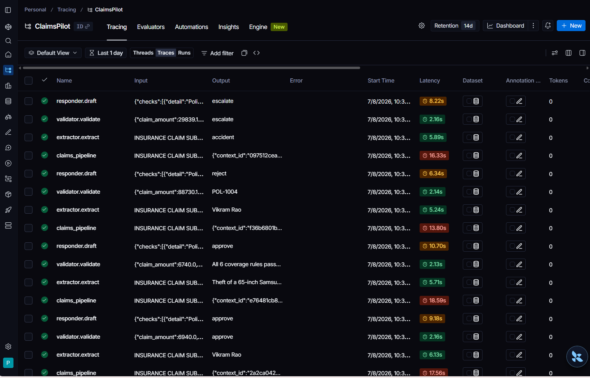

# ✈️ ClaimsPilot — A2A Multi-Agent Claims Processing

Three single-responsibility agents process insurance claims end-to-end and talk to
each other via the **A2A protocol** — the orchestrator delegates with JSON-RPC
`message/send` after Agent Card discovery, never with function calls. Each agent is
an independently deployable HTTP service: kill one, the other two keep serving.

`A2A Protocol · CrewAI · MCP · MongoDB · LangSmith · LM Studio · Gradio · Multi-agent systems`

## Architecture

```
Gradio UI ──► Orchestrator (pure A2A client, LangSmith-traced)
                 │ A2A message/send                 │ A2A                │ A2A
        ┌────────▼─────────┐              ┌─────────▼────────┐  ┌────────▼─────────┐
        │ Agent 1 EXTRACTOR│              │ Agent 2 VALIDATOR│  │ Agent 3 RESPONDER│
        │ :8101            │              │ :8102            │  │ :8103            │
        │ claim doc → JSON │              │ CrewAI crew:     │  │ decision →       │
        │ (LM Studio)      │              │  policy lookup + │  │ accept/reject/   │
        └──────────────────┘              │  rules engine    │  │ escalate letter  │
                                          └────────┬─────────┘  └──────────────────┘
                                              MCP (stdio)
                                          ┌────────▼─────────┐
                                          │ Policy MCP server│──► MongoDB
                                          └──────────────────┘
```

- Every agent publishes an **Agent Card** at `/.well-known/agent-card.json`
  (A2A v1.0: protocolVersion, capabilities, skills).
- Structured payloads travel as A2A **DataParts**; the Pydantic schemas in
  `common/schemas.py` (`ExtractedClaim` → `ValidationResult` → `ResponseLetter`)
  are the inter-agent contract.
- **CrewAI runs inside Agent 2** for the validation sub-tasks (policy-lookup tool +
  rules-engine tool). Coverage verdicts are deterministic code; the crew narrates.
- **MCP** fronts MongoDB: the Validator's policy lookups go through
  `mcp_server/policy_server.py` (stdio) — mountable in LM Studio / Claude Desktop too.
- **LangSmith** traces the full chain: one root run per claim, one child run per A2A
  handoff, with per-agent latency.

## Quickstart

```bash
python -m venv venv && venv\Scripts\activate
pip install -r requirements.txt
copy .env.example .env
```

1. **LM Studio** — load a model → Developer → Start Server (port 1234).
   *(Optional: everything falls back to deterministic paths when offline.)*
2. **Seed policies** — `python scripts/seed_policies.py`
   (MongoDB if running, otherwise an in-memory store with the same data).
3. **Generate synthetic claims** — `python scripts/generate_claims.py --count 60`
   → 60 claim documents + `manifest.json` in `data/claims/`, sampled to hit every
   decision path (approve / reject / escalate).
4. **Start the agents** — `python scripts/start_agents.py`
   (waits until all three Agent Cards respond).
5. **UI** — `python ui/app.py` → upload a claim or pick a sample → watch the
   discovery handshake and per-agent handoffs stream in the log.

**LangSmith (free tier):** set in `.env`
`LANGSMITH_TRACING=true`, `LANGSMITH_API_KEY=...`, `LANGSMITH_PROJECT=claimspilot`.

**CrewAI:** set `CREWAI_ENABLED=true` (needs LM Studio running). With it off, the
Validator runs the same policy-lookup + rules sub-tasks deterministically.

## Measured results

60 synthetic claims (sampled across every decision path), run end-to-end through
the live A2A pipeline against `mistralai/mistral-7b-instruct-v0.3` in LM Studio,
traced in LangSmith (`scripts/run_batch_metrics.py`):

| Metric | Value |
|---|---|
| Claims processed | 60 (0 errors) |
| Decision agreement vs. designed scenario | 57/60 (95.0%) |
| Decision mix | 20 approve · 34 reject · 6 escalate |
| End-to-end latency (extractor → validator → responder) | mean 15.4s · p50 15.1s · p95 17.9s |
| Extractor latency | mean 5.1s |
| Validator latency (CrewAI crew) | mean 2.2s |
| Responder latency | mean 8.1s |
| Test suite | 18/18 passing (`pytest`) |
| LangSmith spans captured | 240 (60 root runs × 3 A2A child handoffs) |

The 3 disagreements are local-model extraction misses (a garbled/missing field
lowering confidence or a misread amount), not rules-engine errors — the
deterministic coverage checks scored 100% given correct extracted input.

## LangSmith traces

<table>
<tr>
<td width="50%">

**Trace waterfall** — one `claims_pipeline` root run with its 3 nested
`a2a_handoff` child spans (extractor → validator → responder), each with its
own latency.



</td>
<td width="50%">

**Trace input/output** — a single run expanded to show the full
`ExtractedClaim` → `ValidationResult` → `ResponseLetter` payload chain and
the final decision.



</td>
</tr>
<tr>
<td width="50%">

**Project dashboard** — trace count, latency percentiles, and error rate
across the 60-claim batch run.



</td>
<td width="50%">

**Run types breakdown** — `a2a_handoff` run count, median latency, and
error rate isolated at depth=1.



</td>
</tr>
</table>

**Traces list** — all 60 `claims_pipeline` runs plus their child
`extractor.extract` / `validator.validate` / `responder.draft` spans, with
per-run latency and output.



## Decision policy

| Outcome | When |
|---|---|
| `approve` | All rules pass and amount ≤ `AUTO_APPROVE_LIMIT` |
| `reject` | Any hard rule fails (policy missing/lapsed, outside coverage window, uncovered incident type, over limit, inside waiting period) |
| `escalate` | Rules pass but amount exceeds auto-approve authority, or extraction confidence is low / fields missing |

## Tests

```bash
pytest
```

No external service needed: the A2A round-trip runs against in-process ASGI apps,
the LLM is mocked, and the policy store falls back to memory. Covers the protocol
(card discovery, DataPart exchange, JSON-RPC errors), the rules engine (all decision
paths), and each agent's fallback behaviour.

## Why A2A instead of one LangGraph pipeline?

Claims processing is multi-step and each step has a different owner in a real GCC.
Protocol-level separation means each agent can be redeployed, scaled, or replaced
(even with a non-Python implementation) without touching the others — the contract
is the Agent Card plus the JSON schemas, not shared code.

Cost: £0 — A2A implemented per open spec, LangSmith free tier, MongoDB Community,
LM Studio, all local.
